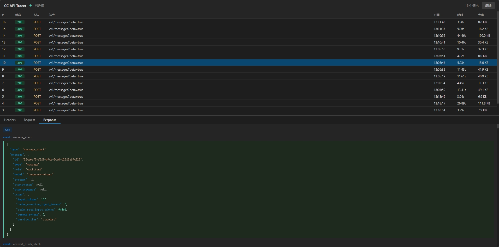

# CC API Tracer

Real-time tracing of requests/responses between Claude Code CLI and the DeepSeek API, with both Web UI and local Markdown file viewing options.

## Requirements

- **Node.js** >= 18 (uses built-in `fetch`, `EventSource`, ESM), v24+ recommended

## Quick Start

```bash
node server.js
```

Open `http://localhost:3000` in your browser to view the Web Console.

## Configuring Claude Code

**Option 1: Environment Variable**

```bash
export ANTHROPIC_BASE_URL="http://localhost:3000"
```

**Option 2: settings.json (persistent)**

Edit `~/.claude/settings.json`:

```json
{
  "env": {
    "ANTHROPIC_BASE_URL": "http://localhost:3000"
  }
}
```

## Features

### Web UI (`http://localhost:3000`)

- **Real-time request list** — pushed via SSE; requests first appear as "pending" and auto-update with status code and duration upon completion
- **Request detail panel** — click a request row to expand three tabs: Headers / Request / Response
- **Smart formatting** — auto-formatting based on Content-Type: JSON syntax-highlighted tree expansion, SSE streaming response parsed event by event
- **API Key masking** — Authorization header displayed as `sk-****xxxx` in the UI
- **Clear button** — clear all session records in one click

### Trace Files (`./traces/`)

A file is automatically generated upon each request completion, independent of Web UI:

```
traces/
├── req-0001-2026-05-08T05-02-01.md          # Request summary
├── req-0001-2026-05-08T05-02-01-request.json  # Request body
└── req-0001-2026-05-08T05-02-01-response.json # Response body
```

Request bodies are saved as separate `.json` or `.txt` files and referenced via links in the Markdown to avoid large files hindering readability.

Markdown summary includes:

- Basic info table (Method, Path, Time, Duration, Status, Size)
- Request / Response Headers (API Key masked)
- Links to Request / Response Body files

## How It Works

```
Claude Code CLI ──→ Proxy (localhost:3000) ──→ DeepSeek API
                        │
                   Web UI (:3000)
                   Trace Files (./traces/)
```

The proxy transparently forwards all requests without modifying the Authorization header. The API Key is configured only in your local Claude Code.

Streaming responses use chunk-by-chunk passthrough: Claude Code receives tokens in real time, while the proxy accumulates the full response for recording.

## Environment Variables

| Variable | Default | Description |
|----------|---------|-------------|
| `PORT` | `3000` | Proxy server port |
| `DEEPSEEK_BASE` | `https://api.deepseek.com/anthropic` | Target API address |
| `MAX_REQUESTS` | `500` | Max requests in Web UI memory |
| `MAX_BODY_SIZE` | `2097152` (2MB) | Max storage bytes per body in Web UI |
| `TRACE_DIR` | `./traces` | Trace file output directory |

> **Note**: `MAX_BODY_SIZE` only limits Web UI display; Trace files always save the full request/response body.

## Screenshot


